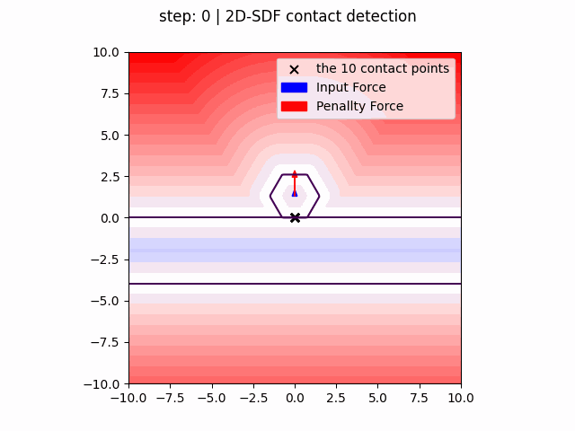
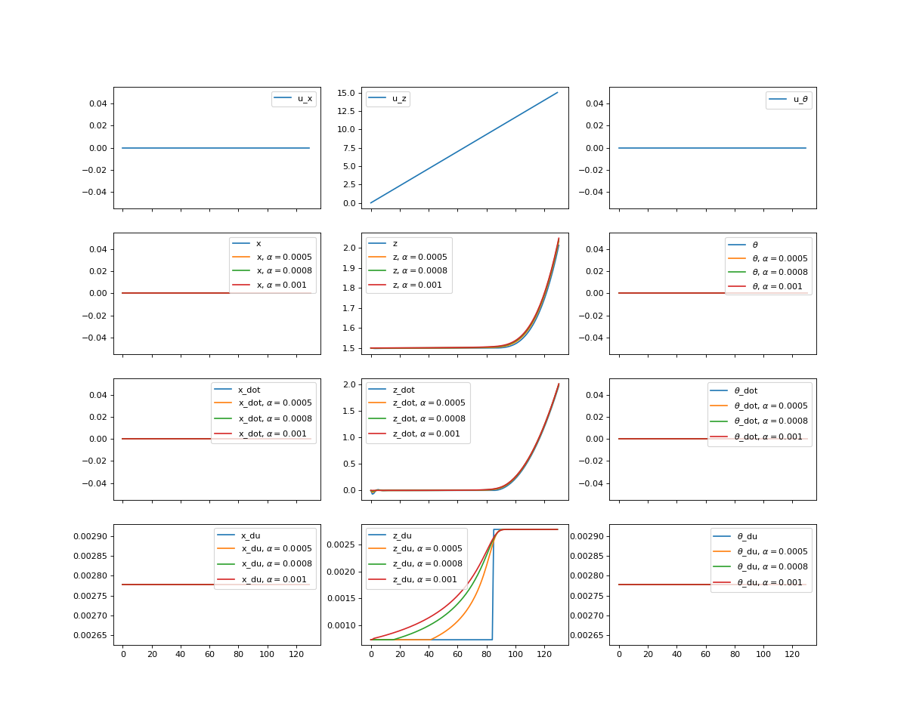

# Virtual Contact 2D
VirtualContact2D is an attempt to implement penalty based contact dynamics with temperature controlled **virtual-contacts**.
It extends the penalty based rigid body dynamics model from two papers:
1. [ADD](https://dl.acm.org/doi/10.1145/3414685.3417766)
2. [DiffRedMax](http://www.roboticsproceedings.org/rss17/p008.pdf), [repo](https://github.com/eanswer/DiffHand)

## Organization
```bash
Readme.md               # this file

main.py                 # a documented example of how to use the package
proof_of_concept.py     # a proof of concept without any dependencies(initial script form where the package was developed)
stein_sgd.py            # stein_sgd implementation as alternative to Newton solver (supposed to deal with virtual contact collapse )

virtual_contact_2d
├── body2d.py           # contains body class that wrapps a 2d-sdf with a rotation/translatins
├── solver.py           # constains solver which solves the penalty based contact problem
├── utils.py            # utility functions
├── virtual_contact.py  # contains VC class which holds vcs and computes penalty forces
└── world.py            # contains world which solves the penallty based contact problem
```

## Installation
The insallation requires only the package [sdf-contacts](https://gitlab.localnet/embodied-vision/mikel-zhobro/planning-with-differentiable-physics/sdf_contacts). No other dependencies are required.

# Math :|

## Penalty based rigid body dynamics
Penalty based rigid body dynamics are simulated forward by solving an implicit differential equation of the form $\mathbf{r(q,\dot q, \ddot q, p)} = 0$, where $\mathbf r:= \mathbf M, (\mathbf q, \mathbf p)\mathbf{\ddot q} - \mathbf f(\mathbf{q, \dot q, p})$. Beside inputs the force component $\mathbf f$ includes the penalty forces that are computed as shown below.

## Computing penalty forces
1. Contact penalty forces:  $\mathbf f_c ( \mathbf q, \mathbf{\dot q}) = -\mathbf n(\mathbf q) \max \left(0, d(\mathbf q)\right) \left(k_n + k_d \dot d(\mathbf q, \mathbf{\dot q})\right)$

2. Coulumb Friction penalty forces: $\mathbf f_t ( \mathbf q, \mathbf{\dot q}) = -\frac{\mathbf{\dot t( \mathbf q, \mathbf{\dot q}) }}{||\mathbf{\dot t( \mathbf q, \mathbf{\dot q}) }||}\min \left( k_t ||\mathbf{\dot t( \mathbf q, \mathbf{\dot q}) }||, \mu ||\mathbf f_c( \mathbf q, \mathbf{\dot q}) || \right)$

## Computing differentiable contacts
1. Compute virtual contacts in world frame :  $\mathbf{^wx_{vc}}=\argmin_\mathbf{x} \psi_1(\mathbf x , \mathbf{q_1}) +\psi_2(\mathbf x , \mathbf{q_2}) + (\psi_1(\mathbf x , \mathbf{q_1}) - \psi_2(\mathbf x , \mathbf{q_2}))^2$
2. In body frame: $\mathbf{^{b_1}x_{vc}} = \mathbf R_1\mathbf{^wx_{vc}} + \mathbf t_1$, assumed independent of state $\mathbf q_1$
3. Project contact points on the surface of the body:  $\mathbf{^{b_1}x_c} = \mathbf{^{b_1}x_{vc}} - \mathbf{^{b_1}n}*d_1$ where  $d_1 = \psi_1(\mathbf{^{b_1}x_{vc}})$

4.  Penetrations: $d(\mathbf q_1, \mathbf q_2) = ||\mathbf D (\mathbf q_1, \mathbf q_2)||_2 =||\mathbf T(\mathbf q_1)\mathbf{^{b_1}x_c} - \mathbf T(\mathbf q_2)\mathbf{^{b_2}x_c} ||_2$

5. Penetration time diff:  $\dot d(\mathbf q_1, \mathbf q_2, \mathbf {\dot q}_1,  \mathbf {\dot q}_2) =  \frac{\mathbf D (\mathbf q_1, \mathbf q_2)}{||\mathbf D (\mathbf q_1, \mathbf q_2)||_2}    \mathbf{\dot D(\mathbf q_1, \mathbf q_2)}$
where $\mathbf{\dot D(\mathbf q_1, \mathbf q_2)} = \mathbf {\dot R}_1 \mathbf x_1 - \mathbf {\dot R}_2 \mathbf x_2 + \mathbf {\dot p}_1 - \mathbf {\dot p}_2$
with $\mathbf {\dot R}_1 \mathbf x_1 =  \mathbf w_1 \times \mathbf {R}_1 \mathbf x_1$ since we are representing velocities in world frame.

6. Contact Normals in body frame: $\mathbf{\tilde n}_1 = \nabla_{\mathbf x } \psi_1(\mathbf x)$, in world frame: $\mathbf n_1(\mathbf q_1) = \mathbf R_1 \mathbf {\tilde n}_1$

7. Contact tangential velocities:
$\mathbf{\dot t}_1(\mathbf q_1, \mathbf{\dot q_1}) = \mathbf T_{proj} (\mathbf v_1 + \mathbf \omega_1 \times \mathbf R_1 \mathbf x_1)$ where $\mathbf T_{proj} = \mathbf I - \mathbf n_1 \mathbf n_1^T$

# Some Visuals

## Lifting some objects



## Input/State/Velocity and Derivatives

